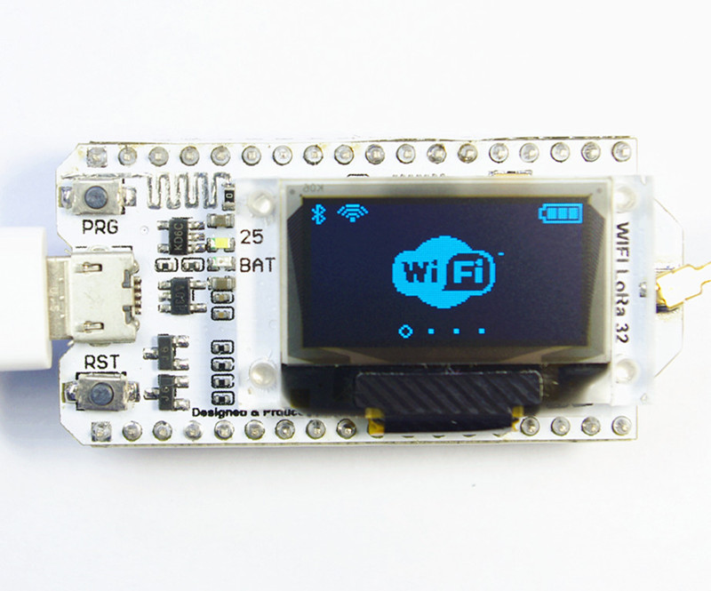

# ESP32 + Lora + OLED

[Producto](https://es.aliexpress.com/item/2-unids-868-MHz-915-MHz-sx1276-esp32-Lora-OLED-0-96-pulgadas-azul-pantalla-Bluetooth/32838347451.html)

[Instrucciones](https://github.com/Heltec-Aaron-Lee/WiFi_Kit_series)

[Instalación del ide](https://github.com/Heltec-Aaron-Lee/WiFi_Kit_series/blob/master/InstallGuide/debian_ubuntu.md)

Board: WIFI_Kit_32

## Características

Technical Parameters:
* Dominant Frequency: 240MHZ
* Flash: 32M-Bits
* Processor: for Tensilica LX6 Dual Core
* Master chip: ESP32
* LoRa chip: SX1276
* Support frequency band: 868-915MHZ
* Open communication distance: 2.8KM
* Computing capacity: up to 600DMIPS
* Dual-mode Bluetooth: traditional Bluetooth and BLE low-power Bluetooth
* Development environment: perfect support for Arduino
* Operating voltage: 3.3-7V
* Operating temperature range: -40-90 ℃
* Receiver sensitivity: -139dBm (SF12, 125KHZ)
* UDP continuous throughput: 135Mbps
* USB adapter chip: CP2102
* Support mode: Sniffer, Station, softAP and Wi-Fi Direct
* Transmit power: 19.5dBm@11b, 16.5dBm@11g, 15.5dBm@11n
* Data rate: 150Mbps @ 11n HT40, 72Mbps @ 11n HT20,
* 54Mbps @ 11g, 11Mbps @ 11b
