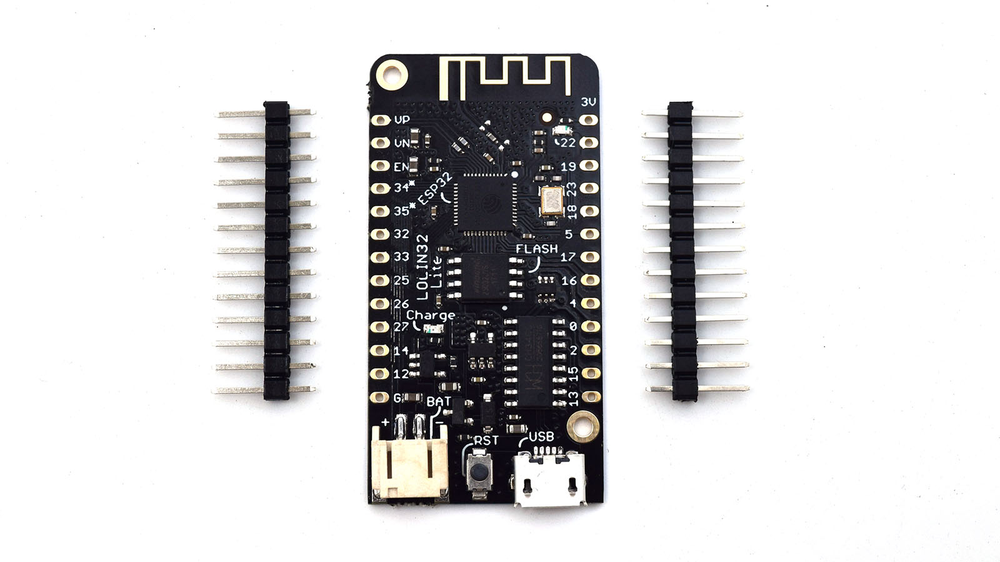
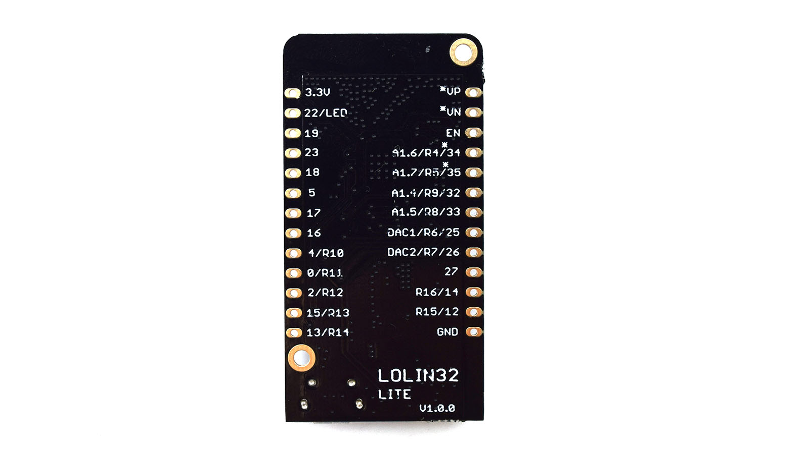
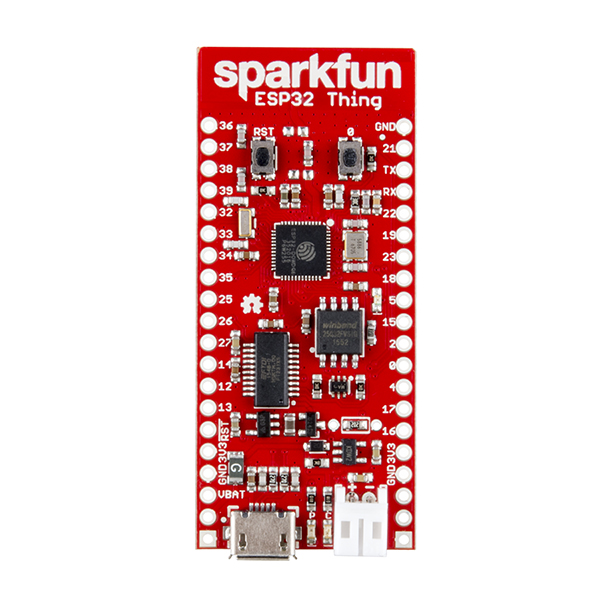
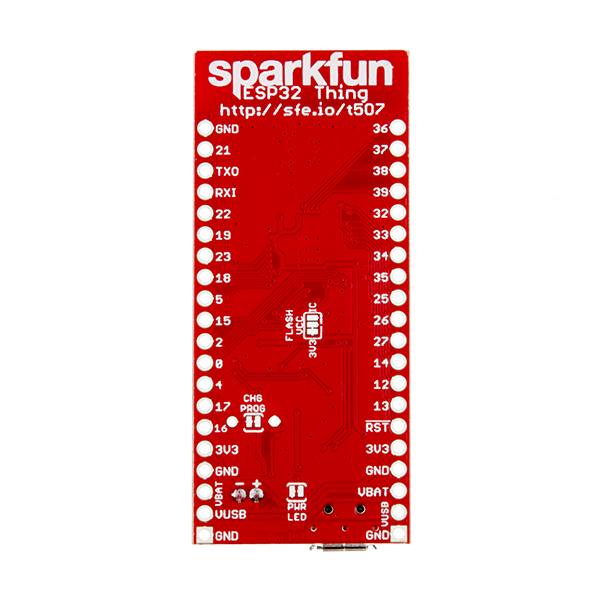
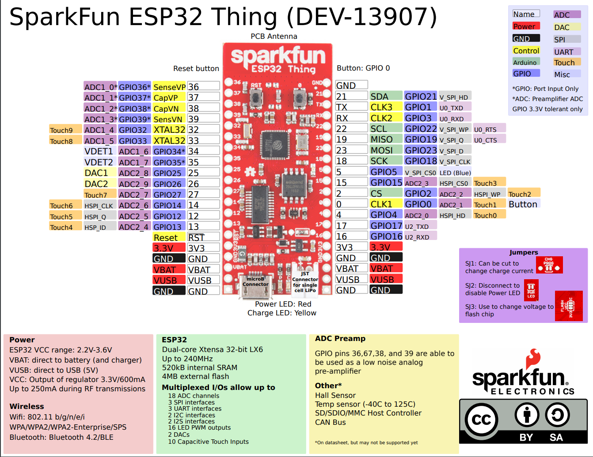

## LOLIN32 lite

Builtinled = 22

Velocidad máxima para cargar 115200 (Max serial baud rate: 256000bps)
OTA Jeve_easyota OK

[Producto](https://www.aliexpress.com/snapshot/0.html?spm=a2g0s.9042647.6.10.saJRzw&orderId=86762581420875&productId=32831394824)

[Gestion de bateria](https://metalab.at/wiki/Wemos_LOLIN32)

[Tutorial muy completo](http://txapuzas.blogspot.com/2018/01/introduccion-esp32-lolin32-lite.html)

## SparkFun ESP32 Thing

[Producto](https://www.sparkfun.com/products/13907)

[Github](https://github.com/sparkfun/ESP32_Thing)

[Pinout](https://cdn.sparkfun.com/datasheets/Wireless/WiFi/ESP32ThingV1.pdf)

